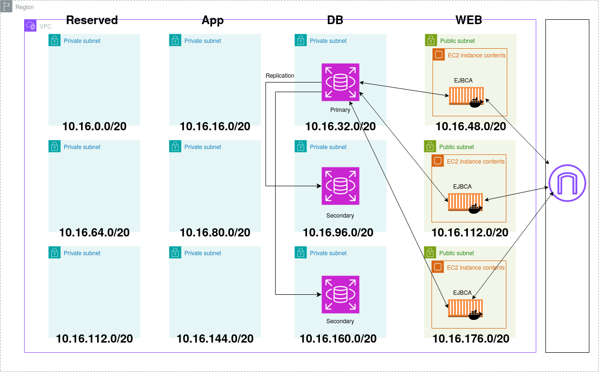

# TODO 
- [ ] Store the state file in Terraform HPC Cloud
- [ ] Use container behind a proxy
- [ ] Have a highly available database setup
# Docker hub ami
https://hub.docker.com/r/keyfactor/ejbca-ce
## Steps to build

## Packer
The ami is build with the packer deploy command, 
``` shell
./deploy-packer.sh
```
That only has to be run if you change the AMI,
Right now the way this setup works is on creation sed is used to to replace the systemd service with the right commands and run the docker container, because the database password and enpoint are only know at terraform apply so its not possible to have the AMI working at the start

``` shell
terraform apply
```

``` shell
sudo apt update
apt install mariadb-client -y
mysql -h <db-endpoint> -u <db-username> -p (enter <dp-password>)
# (Enter <db-password> when prompted)
CREATE DATABASE ejbca;
exit
```
On launch and when the container finishes go do where mycahostname is the public ip of the ec2 instance
https://mycahostname:443/ejbca/ra/enrollwithusername.xhtml?username=superadmin

follow these instructions to setup up to step 3
https://docs.keyfactor.com/ejbca/latest/quick-start-guide-start-ejbca-container-with-clien

- Since the database is external (separate from the container), you can stop and restart the EJBCA container without data loss.
- Currently, the Terraform architecture includes only one EC2 instance and one RDS database to minimize AWS charges.
 



